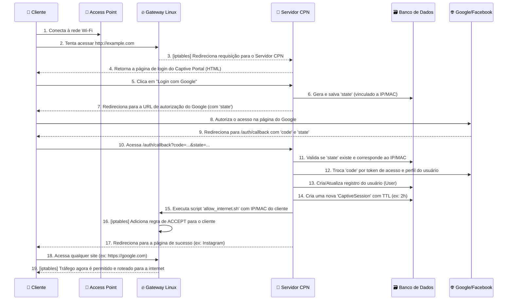
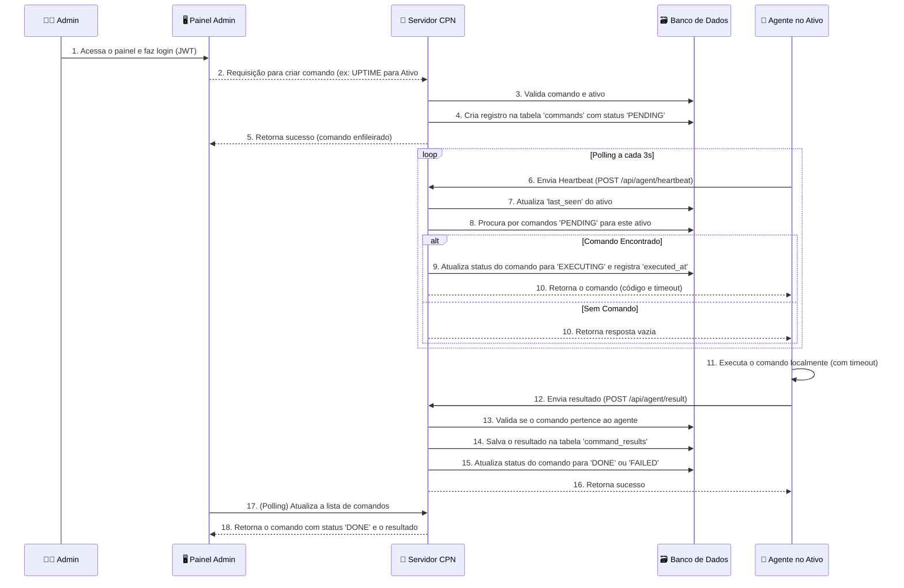
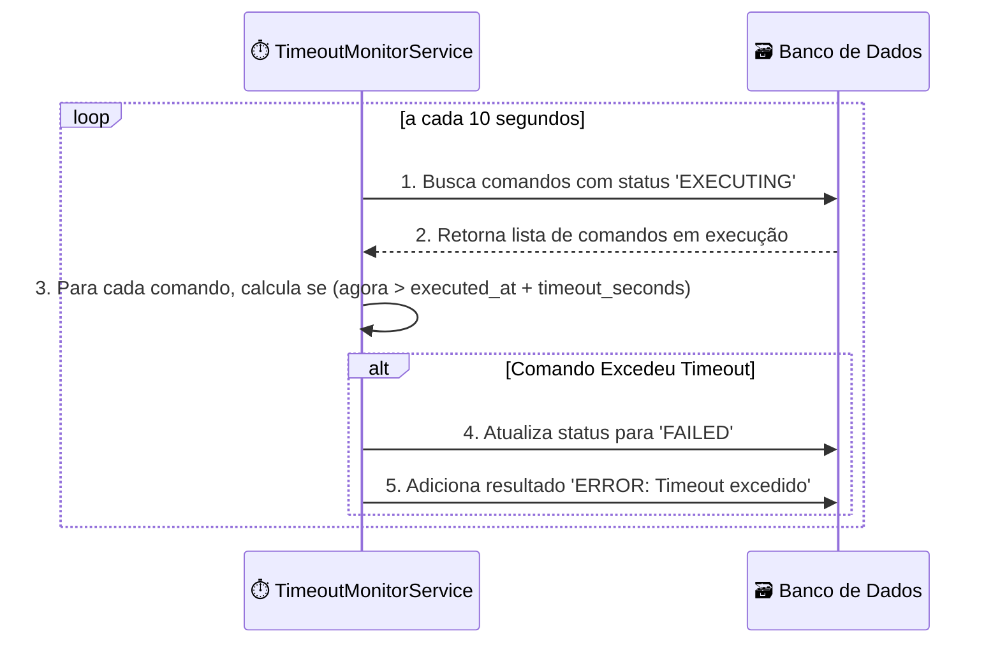
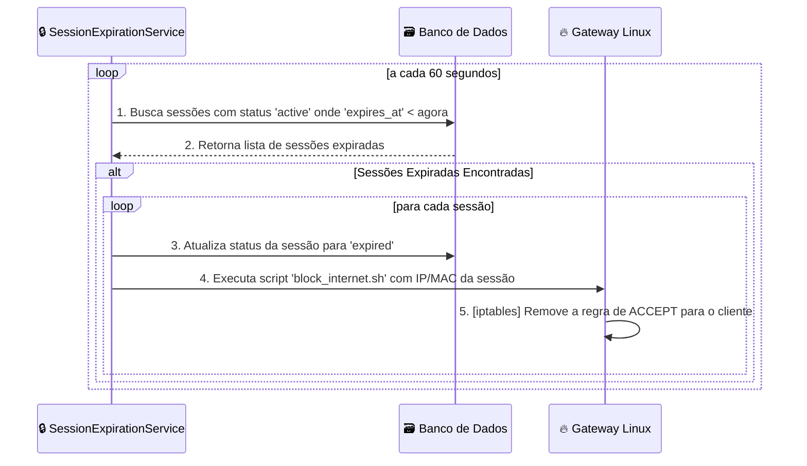

# 2. Fluxos de Ponta a Ponta

Esta seção detalha os principais fluxos de interação do usuário e do sistema, desde a conexão de um cliente Wi-Fi até o gerenciamento remoto de um ativo.

## 2.1. Fluxo de Autenticação do Cliente (Captive Portal)

Este é o fluxo principal para um usuário final que se conecta à rede Wi-Fi.

## 2.2. Fluxo de Execução de Comando Remoto

Este fluxo descreve como um administrador envia um comando para um ativo gerenciado.

## 2.3. Fluxo de Monitoramento de Timeout

Dois serviços de monitoramento rodam em background no Servidor CPN para garantir a integridade do sistema.

### 2.3.1. Timeout de Comandos

- **Objetivo**: Evitar que comandos fiquem presos no estado `EXECUTING` indefinidamente.
- **Gatilho**: `TimeoutMonitorService` roda a cada 10 segundos.

### 2.3.2. Expiração de Sessão de Cliente

- **Objetivo**: Bloquear o acesso à internet de um cliente quando sua sessão expira.
- **Gatilho**: `SessionExpirationService` roda a cada 60 segundos.

