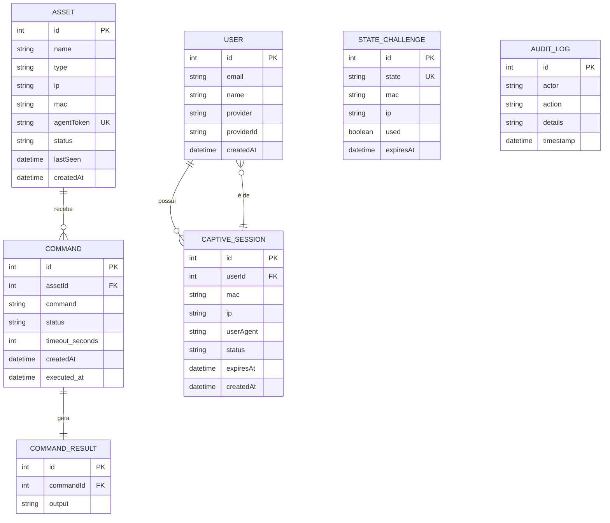

# 3. Modelo de Domínio e Banco de Dados

Esta seção descreve as entidades centrais do sistema e o esquema do banco de dados SQLite.

## 3.1. Diagrama de Entidade-Relacionamento (ERD)

O diagrama abaixo mostra as principais entidades e como elas se relacionam.



## 3.2. Descrição das Entidades

### `USER`
- **Propósito**: Armazena informações sobre os usuários que se autenticam via captive portal.
- **Campos Notáveis**:
    - `provider`: 'google' ou 'facebook'.
    - `providerId`: O ID único do usuário no provedor OAuth.

### `ASSET`
- **Propósito**: Representa um ativo de TI gerenciado (servidor, roteador, etc.).
- **Campos Notáveis**:
    - `agentToken`: Um token único e secreto que o agente usa para se autenticar.
    - `status`: 'online', 'offline', 'pending'. Atualizado com base nos heartbeats.
    - `lastSeen`: Timestamp do último heartbeat recebido.

### `COMMAND`
- **Propósito**: Representa um comando a ser executado em um ativo.
- **Campos Notáveis**:
    - `status`: 'pending', 'executing', 'completed', 'failed'. Gerencia o ciclo de vida do comando.
    - `timeout_seconds`: Tempo máximo em segundos que o agente tem para executar o comando.
    - `executed_at`: Timestamp de quando o agente pegou o comando para executar.

### `COMMAND_RESULT`
- **Propósito**: Armazena a saída (stdout/stderr) de um comando executado.
- **Relacionamento**: 1-para-1 com `COMMAND`.

### `CAPTIVE_SESSION`
- **Propósito**: Representa uma sessão de acesso à internet de um cliente autenticado.
- **Campos Notáveis**:
    - `userAgent`: String do `User-Agent` do navegador do cliente, para fins de auditoria e análise.
    - `status`: 'active', 'expired', 'blocked'.
    - `expiresAt`: Timestamp de quando a sessão expira e o acesso deve ser bloqueado.

### `STATE_CHALLENGE`
- **Propósito**: Tabela temporária para mitigar ataques de CSRF durante o fluxo OAuth.
- **Funcionamento**: Um `state` aleatório é gerado e vinculado ao IP/MAC do cliente. Na volta do callback OAuth, o `state` é validado e depois descartado.

### `AUDIT_LOG`
- **Propósito**: Registra eventos importantes no sistema para fins de auditoria e segurança.
- **Exemplos de Ações**: `USER_LOGIN`, `COMMAND_SENT`, `ASSET_HEARTBEAT`, `SESSION_EXPIRED`.

## 3.3. Esquema do Banco de Dados (SQLite)

O esquema é criado e mantido pelo arquivo `src/db/connection.js`, que é executado na inicialização do servidor.

```sql
-- Tabela de Ativos
CREATE TABLE IF NOT EXISTS assets (
  id INTEGER PRIMARY KEY AUTOINCREMENT,
  name TEXT NOT NULL,
  type TEXT,
  ip TEXT,
  mac TEXT,
  agent_token TEXT NOT NULL UNIQUE,
  status TEXT DEFAULT 'pending',
  last_seen DATETIME,
  created_at DATETIME DEFAULT CURRENT_TIMESTAMP,
  updated_at DATETIME DEFAULT CURRENT_TIMESTAMP
);

-- Tabela de Comandos
CREATE TABLE IF NOT EXISTS commands (
  id INTEGER PRIMARY KEY AUTOINCREMENT,
  asset_id INTEGER NOT NULL,
  code TEXT NOT NULL,
  status TEXT DEFAULT 'PENDING',
  timeout_seconds INTEGER DEFAULT 30,
  created_at DATETIME DEFAULT CURRENT_TIMESTAMP,
  executed_at DATETIME,
  FOREIGN KEY (asset_id) REFERENCES assets (id) ON DELETE CASCADE
);

-- Tabela de Resultados de Comandos
CREATE TABLE IF NOT EXISTS command_results (
  id INTEGER PRIMARY KEY AUTOINCREMENT,
  command_id INTEGER NOT NULL,
  output TEXT,
  FOREIGN KEY (command_id) REFERENCES commands (id) ON DELETE CASCADE
);

-- Tabela de Usuários
CREATE TABLE IF NOT EXISTS users (
  id INTEGER PRIMARY KEY AUTOINCREMENT,
  email TEXT,
  name TEXT,
  provider TEXT,
  provider_id TEXT,
  created_at DATETIME DEFAULT CURRENT_TIMESTAMP
);

-- Tabela de Sessões do Captive Portal
CREATE TABLE IF NOT EXISTS captive_sessions (
  id INTEGER PRIMARY KEY AUTOINCREMENT,
  user_id INTEGER NOT NULL,
  mac TEXT,
  ip TEXT,
  user_agent TEXT,
  status TEXT DEFAULT 'active',
  expires_at DATETIME,
  created_at DATETIME DEFAULT CURRENT_TIMESTAMP,
  FOREIGN KEY (user_id) REFERENCES users (id)
);

-- Tabela de Desafios de Estado OAuth
CREATE TABLE IF NOT EXISTS state_challenges (
  id INTEGER PRIMARY KEY AUTOINCREMENT,
  state TEXT NOT NULL UNIQUE,
  mac TEXT,
  ip TEXT,
  used BOOLEAN DEFAULT FALSE,
  expires_at DATETIME DEFAULT (datetime('now', '+10 minutes')),
  created_at DATETIME DEFAULT CURRENT_TIMESTAMP
);

-- Tabela de Logs de Auditoria
CREATE TABLE IF NOT EXISTS audit_logs (
  id INTEGER PRIMARY KEY AUTOINCREMENT,
  actor TEXT,
  action TEXT NOT NULL,
  details TEXT,
  timestamp DATETIME DEFAULT CURRENT_TIMESTAMP
);
```

### Índices para Performance

Para garantir a performance das consultas, os seguintes índices são criados:

```sql
CREATE INDEX IF NOT EXISTS idx_commands_asset_status ON commands (asset_id, status);
CREATE INDEX IF NOT EXISTS idx_sessions_status_expires ON captive_sessions (status, expires_at);
CREATE INDEX IF NOT EXISTS idx_assets_token ON assets (agent_token);
CREATE INDEX IF NOT EXISTS idx_challenges_state ON state_challenges (state);
```
