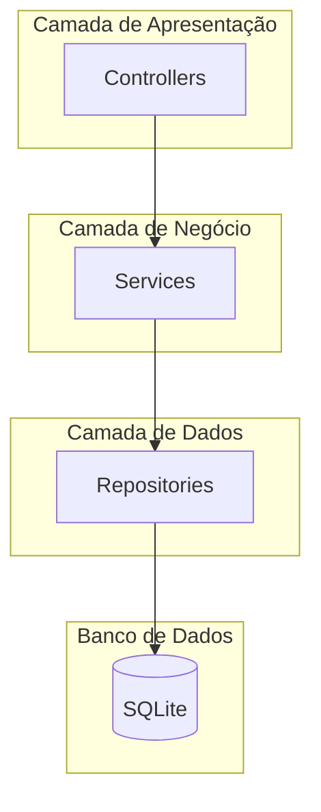
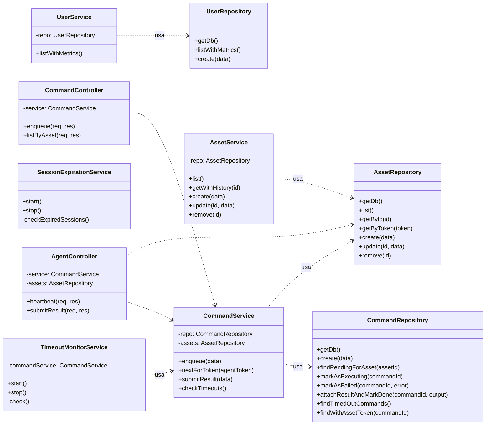

# 4. Diagrama de Classes (UML)

Este documento apresenta um diagrama de classes UML simplificado para as principais classes de Serviço e Repositório, ilustrando a separação de responsabilidades e as dependências entre as camadas.

## 4.1. Visão Geral da Arquitetura de Classes

O backend segue um padrão de arquitetura em camadas para promover a separação de conceitos (SoC) e o princípio da responsabilidade única (SRP).

-   **Controllers**: Responsáveis por lidar com a camada HTTP (requisições e respostas). Não contêm lógica de negócio.
-   **Services**: Orquestram as regras de negócio. Podem usar um ou mais repositórios para cumprir uma tarefa.
-   **Repositories**: Responsáveis pelo acesso e manipulação de dados no banco de dados. São a única camada que "fala" SQL.

## 4.2. Diagrama de Classes Detalhado

O diagrama abaixo foca nas classes de `Service` e `Repository` e seus principais métodos.

## 4.3. Descrição das Principais Classes

### Repositories (`src/repositories/`)

-   **`AssetRepository`**: Encapsula todas as operações de CRUD para a entidade `Asset`. Métodos como `getByToken` são otimizados com índices para performance.
-   **`CommandRepository`**: Gerencia o ciclo de vida dos comandos no banco de dados. Contém a lógica SQL para encontrar comandos pendentes, expirados e para atualizar seus status.
-   **`UserRepository`**: Lida com a persistência de usuários e agrega métricas de acesso, como número de logins e tempo médio de sessão.
-   **`AuditRepository`**: Simplesmente insere registros na tabela `audit_logs`.

### Services (`src/services/`)

-   **`AssetService`**: Orquestra a lógica de negócio para ativos. Por exemplo, ao buscar um ativo, também pode buscar seu histórico de comandos.
-   **`CommandService`**: Contém a lógica de enfileiramento e processamento de comandos. Valida se um comando é permitido e se o ativo existe antes de chamar o repositório. O método `checkTimeouts` é chamado pelo serviço de monitoramento.
-   **`AuthService`**: Gerencia a lógica de autenticação do painel de admin, incluindo a geração e validação de tokens JWT.
-   **`TimeoutMonitorService`**: Um serviço de background que periodicamente (a cada 10s) invoca `CommandService.checkTimeouts()` para garantir que nenhum comando fique "preso" no estado `EXECUTING`.
-   **`SessionExpirationService`**: Outro serviço de background que, a cada 60s, verifica no banco por sessões de captive portal que expiraram e executa o script `block_internet.sh` para revogar o acesso.

### Controllers (`src/controllers/`)

-   **`AssetController`**: Expõe os métodos do `AssetService` como endpoints HTTP RESTful (`GET /assets`, `POST /assets`, etc.).
-   **`CommandController`**: Permite que administradores enfileirem novos comandos.
-   **`AgentController`**: Fornece os endpoints que o agente consome: `heartbeat` para polling de comandos e `submitResult` para enviar os resultados.
-   **`AuthController`**: Lida com o login do admin (`/login`) e fornece um endpoint para verificar o status da autenticação (`/me`).
-   **`UserController`**: Expõe os dados de usuários e métricas para o painel de admin.
